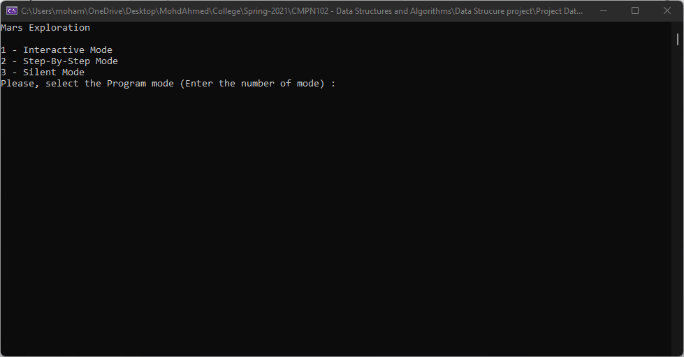
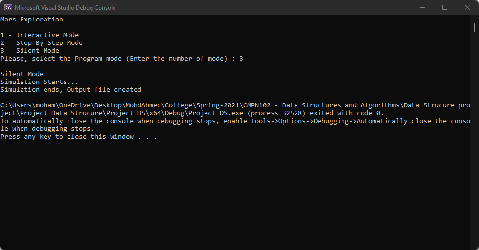
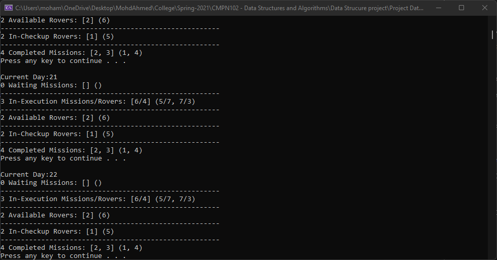

# MARS Exploration Simulator

## Description

An simulator program that simulates the mission assignment process on the mars and calculates some related statistics in order to help improve the overall process.

## Chosen Data structure

| *List Name* | *Typ* | *Reason*
| ----------- | ----------- | ----------- |
| **Events** | Queue | events are excuted in the same order they are loaded from file (by arrival time) FCFS |
| **MISSIONS:** | | |
| Waiting emergency | PriQ | served depednig on pri |
| Waiting Polar | Queue | First ready first serve |
| Completed Missions | Queue | "It should be sorted by CD so they enter Q by CD and also Leave by CD to be printed to the file" |
| In-execution missions | No need for separate list. | Each in-exec mission can be pointed to by a pointer inside the rover executing it (or vise-versa) |
| **ROVERS:** | | |
| Available Emergency | Queue | First available first use |
| Available Polar | Queue | First available first use |
| In-Execution | one PriQ for all rovers | the order they leave the list depends on their finish time. So priority can be the finish time |
| In-Checkup | a Separate Queue for each rover type | Rovers leave checkup list in the same order they entered as checkup time is constant for each type |

## Preview

### Start Window

### Silent Mode

### Interactive & Step-By-step Mode

## Contributers

Me & yayaelbasha
